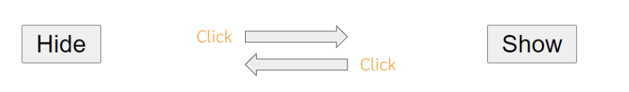

- จงสร้าง Button มีข้อความว่า “Hide”
- เมื่อผู้ใช้ click button ให้ซ่อนข้อความและเปลี่ยนข้อความบน Button เป็น “Show”
- เมื่อ click button อีกครั้งให้แสดงข้อความและเปลี่ยนข้อความบน Button เป็น Hide

