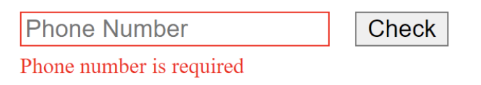

- จงสร้าง Input และ Button ดังรูปเมื่อผู้ใช้กรอกเบอร์โทรและกด Check 
  - ถ้าผู้ใช้ไม่กรอกให้ขึ้นข้อความ Phone Number is required 
  - ถ้าผู้ใช้กรอกค่าที่ไม่ใช่ตัวเลขให้ขึ้นข้อความ Phone Number is invalid
  - ถ้าผู้ใช้กรอกค่าที่มีความยาวไม่เท่ากับ 10 ให้ขึ้นข้อความ Invalid length
  - ถ้ากรอกถูกต้องให้ Alert “Your number is valid”

