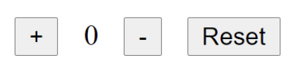

- จงสร้าง Counter มี button การทำงานและตัวเลขดังรูป
-เมื่อผู้ใช้ click + ให้เพิ่มค่าตัวเลขขึ้น 1
- เมื่อผู้ใช้ click - ให้ลดค่าตัวเลขลง 1
-เมื่อผู้ใช้ click Reset ให้ reset ค่าตัวเลขเป็น 0
- ตัวเลขห้ามติดลบ

