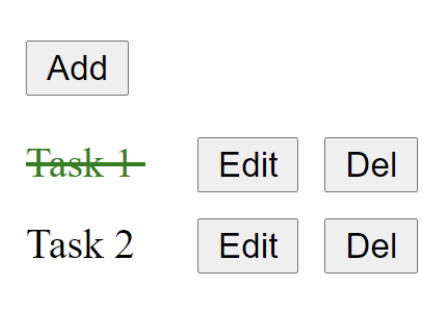

จงสร้าง Todo List ดังรูป
- เมื่อผู้ใช้ click Add ให้เพิ่มรายการ
- เมื่อผู้ใช้ click Edit ให้แก้ไขข้อความ
- เมื่อผู้ใช้ click Del ให้ลบรายการ
- เมื่อผู้ใช้ click ที่รายการใน List ให้
- Toggle เส้นที่ขีดค่าข้อความ  

